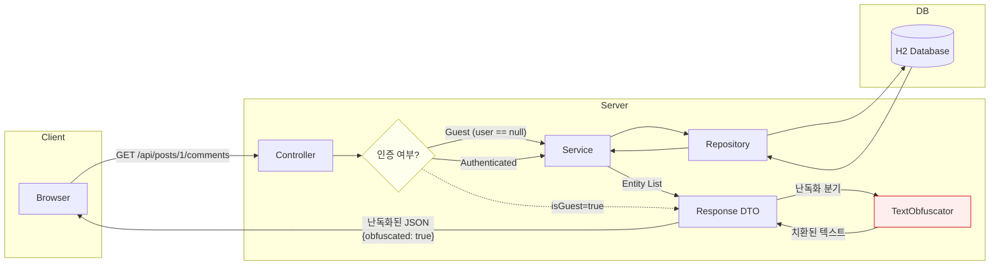
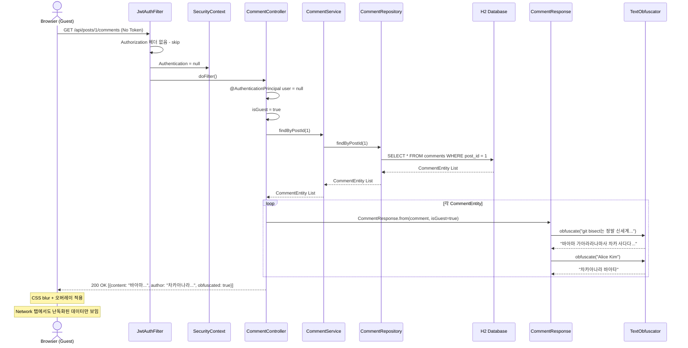
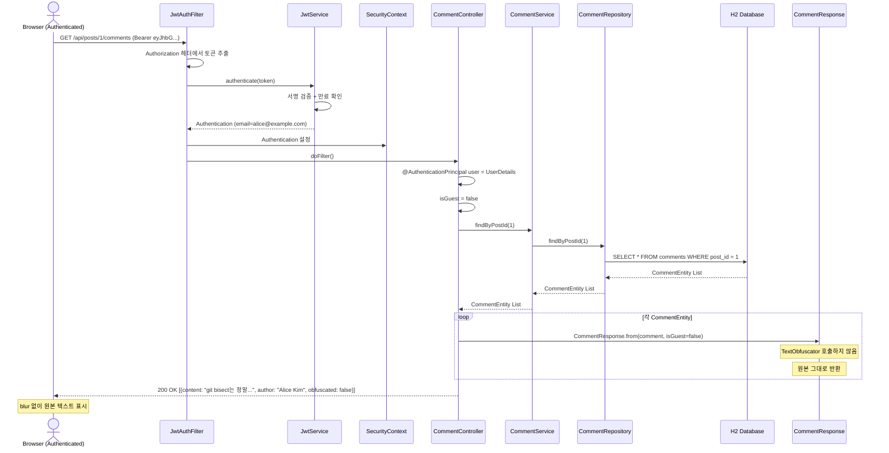

# Guest Blur

비로그인 사용자에게 데이터를 난독화하여 반환하는 프로젝트.

CSS blur만 적용하면 개발자 도구로 원본 데이터를 확인할 수 있는 문제를 해결한다.
API(Presentation Layer)에서 비로그인 유저에게 텍스트를 난독화하여 반환하고, 프론트에서 blur UI를 추가 적용한다.

> YouTube 영상 "로그인 전 블러 처리 데이터 어떻게 구현 할까?" (제미니의 개발실무) 참고

## 기술 스택

| Layer | Stack |
|-------|-------|
| Backend | Spring Boot 3, Java 17, Spring Security (JWT), Spring Data JPA, H2 |
| Frontend | React 18, TypeScript, Vite, Axios |
| Test | JUnit 5, MockMvc, JaCoCo (83%+), Playwright |

## 핵심 아이디어

```
Guest 요청 → API → TextObfuscator로 글자 치환 (공백 유지) → 난독화된 JSON 반환
                  ↓
                  프론트에서 CSS blur + 로그인 유도 오버레이

인증된 요청 → API → 원본 텍스트 그대로 반환
```

- **Network 탭**에서도 난독화된 데이터만 보임
- **CSS blur 제거**해도 난독화된 텍스트만 보임
- 로그인 후 같은 API 호출 시 원본 텍스트 확인 가능

## Presentation Layer 핵심 로직

난독화는 서버의 Presentation Layer(Response DTO)에서 처리한다. 클라이언트에 데이터가 도달하기 전에 이미 치환되므로, 프론트엔드를 아무리 조작해도 원본을 볼 수 없다.

### Data Flow



### Sequence Diagram - Guest 요청



### Sequence Diagram - Authenticated 요청



### 1. TextObfuscator - 텍스트 치환

```java
// presentation/TextObfuscator.java
public static String obfuscate(String text) {
    StringBuilder sb = new StringBuilder(text.length());
    for (char c : text.toCharArray()) {
        if (Character.isWhitespace(c)) {
            sb.append(c);               // 공백/줄바꿈 유지 (레이아웃 보존)
        } else {
            sb.append(CHARS.charAt(Math.abs(c % CHARS.length())));  // 한글로 치환
        }
    }
    return sb.toString();
}
```

### 2. Response DTO - 조건부 난독화

Controller에서 `@AuthenticationPrincipal`로 인증 여부를 판단하고, Response DTO 변환 시 난독화를 적용한다.

```java
// comment/CommentController.java
@GetMapping
public ResponseEntity<List<CommentResponse>> getByPostId(
        @PathVariable Long postId,
        @AuthenticationPrincipal UserDetails user) {
    boolean isGuest = (user == null);
    List<CommentResponse> response = commentService.findByPostId(postId).stream()
            .map(comment -> CommentResponse.from(comment, isGuest))
            .toList();
    return ResponseEntity.ok(response);
}

// comment/CommentResponse.java
public static CommentResponse from(CommentEntity comment, boolean obfuscate) {
    return new CommentResponse(
            comment.getId(),
            obfuscate ? TextObfuscator.obfuscate(comment.getContent()) : comment.getContent(),
            obfuscate ? TextObfuscator.obfuscate(comment.getAuthor().getNickname()) : comment.getAuthor().getNickname(),
            comment.getCreatedAt(),
            obfuscate   // 프론트에서 blur UI 분기에 사용
    );
}
```

### 3. 프론트엔드 - CSS blur + 오버레이

서버에서 받은 `obfuscated` 플래그로 blur UI를 적용한다. CSS blur는 보조적 역할이며, 제거해도 난독화된 텍스트만 보인다.

- **게시글 목록 카드**: content, author에 `blur(4px)` (오버레이 없음)
- **게시글 상세 본문**: `blur(6px)` + "로그인하고 본문을 확인하세요" 오버레이
- **댓글**: `blur(6px)` + "로그인하고 댓글을 확인하세요" 오버레이

## 프로젝트 구조

```
guest-blur/
├── backend/                    # Spring Boot API 서버
│   └── src/main/java/.../
│       ├── auth/               # JWT 인증 (JwtService, JwtAuthFilter, AuthController)
│       ├── config/             # SecurityConfig, JpaConfig, DataInitializer
│       ├── post/               # 게시글 CRUD
│       ├── comment/            # 댓글 CRUD (비로그인: 난독화)
│       ├── presentation/       # TextObfuscator (핵심 난독화 유틸)
│       └── user/               # UserEntity, UserRepository
├── frontend/                   # React SPA
│   └── src/
│       ├── api/                # Axios 클라이언트
│       ├── auth/               # AuthContext, LoginForm, useAuth
│       ├── components/         # PostList, PostCard, CommentList, BlurOverlay, Layout
│       └── styles/             # CSS
└── e2e/                        # Playwright E2E 테스트
```

## 실행 방법

### 사전 요구사항

- Java 17+
- Node.js 18+ 또는 Bun

### Backend

```bash
cd backend
./gradlew bootRun
```

`http://localhost:8080`에서 API 서버 시작. H2 콘솔: `http://localhost:8080/h2-console`

### Frontend

```bash
cd frontend
bun install   # 또는 npm install
bun dev       # 또는 npm run dev
```

`http://localhost:5173`에서 개발 서버 시작 (API 요청은 백엔드로 프록시)

### E2E 테스트

```bash
# 백엔드와 프론트엔드가 실행 중인 상태에서
cd e2e
bun install
npx playwright install chromium
npx playwright test
```

## API 엔드포인트

| Method | Path | Auth | 설명 |
|--------|------|:----:|------|
| POST | /api/auth/signup | - | 회원가입 |
| POST | /api/auth/login | - | 로그인 (JWT 반환) |
| GET | /api/posts | - | 게시글 목록 (비로그인: content, author 난독화 + blur) |
| GET | /api/posts/{id} | - | 게시글 상세 (비로그인: content, author 난독화 + blur) |
| GET | /api/posts/{id}/comments | - | 댓글 목록 (비로그인: content, author 난독화 + blur) |
| POST | /api/posts | O | 게시글 작성 |
| POST | /api/posts/{id}/comments | O | 댓글 작성 |

## 테스트 계정

| Email | Password | Nickname |
|-------|----------|----------|
| alice@example.com | password | Alice Kim |
| bob@example.com | password | Bob Park |
| charlie@example.com | password | Charlie Lee |

## TextObfuscator 동작 방식

```java
// 입력: "Hello World"
// 출력: "가하다다다 차다다다다"  (공백 위치 유지, 글자만 한글로 치환)
```

- 비공백 문자 -> 한글 문자("가나다라마바사아자차카타파하")로 치환
- 공백, 줄바꿈, 탭 -> 그대로 유지
- 결정적(deterministic): 같은 입력은 항상 같은 출력

## 테스트 커버리지

```
INSTRUCTION: 83.0%
BRANCH:      81.6%
LINE:        87.9%
```

```bash
cd backend
./gradlew test jacocoTestReport
# 리포트: build/reports/jacoco/test/html/index.html
```

## 검증 방법

1. 비로그인 상태로 `http://localhost:5173` 접속
2. 게시글 목록에서 content, author가 난독화 + blur 처리된 것 확인
3. 게시글 클릭 -> 본문 영역에 blur + "로그인하고 본문을 확인하세요" 오버레이 확인
4. 댓글 영역에 blur + "로그인하고 댓글을 확인하세요" 오버레이 확인
5. 개발자 도구 Network 탭에서 `/api/posts`, `/api/posts/1/comments` 응답 확인 -> 난독화된 데이터
6. 개발자 도구에서 CSS blur 제거해도 난독화된 텍스트만 보임
7. 로그인 후 같은 API 호출 -> 원본 텍스트 확인
